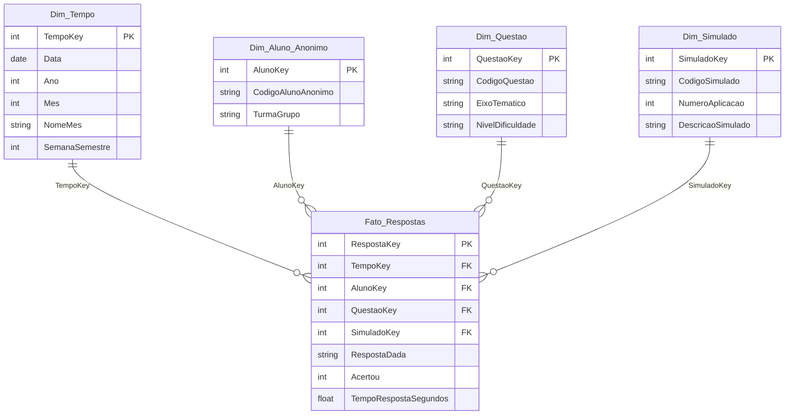

# BUSINESS INTELLIGENCE — PROJETO INTEGRADOR

## MODELO DE DADOS (DATA WAREHOUSE)

### ENADE Analytics — Marco 2

| **Entrega**               | Até o final da Semana 8 (Marco 2)                                              |
| ------------------------- | ------------------------------------------------------------------------------ |
| **Equipe**                | RevelaDados — João Junior, Alessandro Sondey, Leandro Zeni                     |
| **Responsável principal** | João Junior                                                                    |
| **Base de referência**    | [Marco 0](./marco-0.md) · [Marco 1](./marco-1.md) · [TCLE](./termo-lgpd.md) · Portaria Inep nº 171/2026 |
| **Data**                  | 10/09/2026                                                                     |

_Este documento é o entregável do Marco 2. Ele formaliza o modelo dimensional
(esquema estrela) do banco de questões e respostas do simulado ENADE, para
implementação no Power BI. Requisitos relacionados: RF01, RF02, RF03, RF04,
RF05, RF06, RF08, RNF01, RNF02._

---

> **Status:** Modelo dimensional definido. A captura da visão Modelo do Power BI
> deve substituir o diagrama conceitual da Seção 3 após a implementação.

## 1. Visão geral e grão da tabela fato

O Data Warehouse organiza as respostas dos simulados em um **esquema estrela**:
uma tabela fato no centro e quatro dimensões ao redor. Essa estrutura atende às
perguntas do briefing (desempenho por eixo, comparação entre turmas, evolução no
semestre) sem armazenar identificadores pessoais diretos.

**Grão de `Fato_Respostas`:** cada registro representa **1 resposta, de 1 aluno
anônimo, a 1 questão, em 1 tentativa/aplicação de simulado**.

Esse nível de detalhe permite analisar desempenho por eixo, turma/grupo e
período sem identificar o estudante. Agregações (taxa de acerto, participantes
distintos, evolução entre aplicações) são calculadas por medidas DAX no Power BI,
e não persistidas na fato.

## 2. Esquema estrela implementado

| **Tabela** | **Campos** |
| ---------- | ---------- |
| **Fato_Respostas** | `RespostaKey`; `TempoKey`; `AlunoKey`; `QuestaoKey`; `SimuladoKey`; `RespostaDada`; `Acertou`; `TempoRespostaSegundos` |
| **Dim_Tempo** | `TempoKey`; `Data`; `Ano`; `Mes`; `NomeMes`; `SemanaSemestre` |
| **Dim_Aluno_Anonimo** | `AlunoKey`; `CodigoAlunoAnonimo`; `TurmaGrupo` |
| **Dim_Questao** | `QuestaoKey`; `CodigoQuestao`; `EixoTematico`; `NivelDificuldade` |
| **Dim_Simulado** | `SimuladoKey`; `CodigoSimulado`; `NumeroAplicacao`; `DescricaoSimulado` |

Relacionamentos: cada dimensão se liga à fato pela chave substituta
correspondente (`TempoKey`, `AlunoKey`, `QuestaoKey`, `SimuladoKey`).
Cardinalidade **1:\*** (uma linha da dimensão, muitas na fato), com filtro
**unidirecional** da dimensão para a fato.

## 3. Diagrama do esquema estrela

Diagrama conceitual da modelagem. Na entrega do Power BI, substituir pela
captura da visão **Modelo**.

## 4. Tabelas de dimensão

| **Tabela** | **Descrição** | **Atributos principais** |
| ---------- | ------------- | ------------------------ |
| Dim_Tempo | Calendário da aplicação/resposta, para evolução ao longo do semestre (RF05). Hierarquia: Ano → Mês → Data. | TempoKey, Data, Ano, Mes, NomeMes, SemanaSemestre |
| Dim_Aluno_Anonimo | Participante sem identificação direta. Permite comparar turmas/grupos (RF03) e analisar distribuição de lacunas sem nomear estudantes (RF04, RF08). | AlunoKey, CodigoAlunoAnonimo, TurmaGrupo |
| Dim_Questao | Banco de questões classificado por eixo do componente específico e dificuldade (RF01). | QuestaoKey, CodigoQuestao, EixoTematico, NivelDificuldade |
| Dim_Simulado | Cada aplicação do simulado no semestre, para comparar tentativas (RF05). | SimuladoKey, CodigoSimulado, NumeroAplicacao, DescricaoSimulado |

## 5. Tabela fato

| **Tabela** | **Descrição** | **Métricas** |
| ---------- | ------------- | ------------ |
| Fato_Respostas | Uma linha por resposta de um aluno anônimo a uma questão, em uma aplicação. Integra as quatro dimensões e preserva turma/grupo, eixo e período (RF02, RF06). | RespostaDada; Acertou (0/1, aditivo); TempoRespostaSegundos |

`Acertou` é um **contador aditivo** (1 = correto, 0 = incorreto), o que permite
`SUM` para total de acertos e `DIVIDE` para taxa de acerto por qualquer
combinação de filtros (eixo, turma, simulado, período).

## 6. Dicionário de dados

| **Tabela** | **Campo / medida** | **Tipo** | **Descrição** |
| ---------- | ------------------ | -------- | ------------- |
| Fato_Respostas | RespostaKey | Inteiro (PK) | Chave técnica única de cada resposta registrada. |
| Fato_Respostas | TempoKey | Inteiro (FK) | Relaciona a resposta à Dim_Tempo. |
| Fato_Respostas | AlunoKey | Inteiro (FK) | Relaciona a resposta ao aluno anonimizado. |
| Fato_Respostas | QuestaoKey | Inteiro (FK) | Relaciona a resposta à questão respondida. |
| Fato_Respostas | SimuladoKey | Inteiro (FK) | Relaciona a resposta à aplicação do simulado. |
| Fato_Respostas | RespostaDada | Texto | Alternativa/resposta registrada pelo participante. |
| Fato_Respostas | Acertou | Inteiro (0/1) | Contador aditivo: 1 para resposta correta e 0 para incorreta. |
| Fato_Respostas | TempoRespostaSegundos | Número | Tempo gasto na resposta, quando disponível na coleta. |
| Dim_Tempo | TempoKey | Inteiro (PK) | Chave substituta da dimensão de tempo. |
| Dim_Tempo | Data | Data | Data da aplicação/resposta. |
| Dim_Tempo | Ano | Inteiro | Ano da aplicação. |
| Dim_Tempo | Mes | Inteiro | Número do mês. |
| Dim_Tempo | NomeMes | Texto | Nome do mês para agrupamentos e ordenação. |
| Dim_Tempo | SemanaSemestre | Inteiro | Semana do semestre, usada para acompanhar evolução temporal. |
| Dim_Aluno_Anonimo | AlunoKey | Inteiro (PK) | Chave substituta do participante no DW. |
| Dim_Aluno_Anonimo | CodigoAlunoAnonimo | Texto | Código sem identificação direta (ex.: `Aluno_014`). |
| Dim_Aluno_Anonimo | TurmaGrupo | Texto | Turma ou grupo de análise, sem nome nominal. |
| Dim_Questao | QuestaoKey | Inteiro (PK) | Chave substituta da questão. |
| Dim_Questao | CodigoQuestao | Texto | Identificador interno da questão do banco de simulados. |
| Dim_Questao | EixoTematico | Texto | Objeto de conhecimento/eixo do componente específico do ENADE 2026. |
| Dim_Questao | NivelDificuldade | Texto | Classificação da equipe: Fácil, Médio ou Difícil. |
| Dim_Simulado | SimuladoKey | Inteiro (PK) | Chave substituta da aplicação do simulado. |
| Dim_Simulado | CodigoSimulado | Texto | Código ou nome curto do simulado. |
| Dim_Simulado | NumeroAplicacao | Inteiro | Ordem da aplicação ao longo do semestre. |
| Dim_Simulado | DescricaoSimulado | Texto | Descrição da aplicação do simulado. |

## 7. Medidas DAX documentadas

| **Nome da medida** | **Fórmula DAX** | **O que calcula** |
| ------------------ | --------------- | ----------------- |
| Total Respostas | `COUNTROWS(Fato_Respostas)` | Total de respostas no contexto de filtro. |
| Total Acertos | `SUM(Fato_Respostas[Acertou])` | Soma dos acertos (1) das respostas selecionadas. |
| Taxa de Acerto | `DIVIDE([Total Acertos], [Total Respostas], 0)` | Proporção de acertos por eixo, turma, simulado ou período (RF02). |
| Alunos Participantes | `DISTINCTCOUNT(Fato_Respostas[AlunoKey])` | Quantos alunos anônimos distintos participaram no contexto analisado (RF04). |

As medidas respeitam o contexto de filtro das dimensões: a mesma `Taxa de Acerto`
responde à pergunta 1 do briefing (por eixo), à pergunta 2 (por turma/grupo) e à
pergunta 4 (por simulado/período). `Alunos Participantes` apoia a pergunta 3
(lacunas concentradas versus distribuídas), detalhada no [Marco 3](./marco-3.md).

## 8. Processo de ETL / carga de dados

Ferramentas gratuitas apenas (RNF03): Microsoft Forms, planilhas e Power BI
Desktop.

1. **Extração**
   - Banco de questões (eixo temático e nível de dificuldade) em planilha.
   - Respostas do simulado via Microsoft Forms (alternativa/resposta, acerto,
     tempo quando disponível, turma/grupo, data da aplicação).
2. **Transformação (antes da modelagem dimensional)**
   - Aplicar o [TCLE](./termo-lgpd.md) como condição de inclusão (RNF02).
   - Substituir qualquer identificador original por `CodigoAlunoAnonimo`
     (ex.: `Aluno_014`). Nome, CPF, e-mail e equivalentes **não entram** no DW
     (RNF01).
   - Gerar chaves substitutas (`*Key`) e normalizar códigos de questão, simulado
     e turma/grupo.
   - Calcular `Acertou` (0/1) a partir do gabarito da planilha de questões.
   - Montar `Dim_Tempo` a partir da data da aplicação.
3. **Carga**
   - Importar as cinco tabelas no Power BI Desktop, criar os relacionamentos
     1:\* e publicar as medidas DAX da Seção 7.

O dashboard ([Marco 4](./marco-4.md)) consome apenas visões agregadas por
turma/eixo — nunca uma linha identificável de estudante (RF08).

## 9. Conformidade com a LGPD

O modelo não contém identificadores diretos. Itens ligados à **coleta** ficam
pendentes até o simulado-piloto.

- [x] Nenhuma dimensão do modelo contém nome, CPF, e-mail ou outro identificador
      direto do estudante — apenas `CodigoAlunoAnonimo` e `TurmaGrupo`.
- [x] O processo de carga prevê anonimização (código do aluno, não o dado
      original) **antes** da modelagem dimensional. Ver [termo-lgpd.md](./termo-lgpd.md).
- [ ] O TCLE simplificado ([Marco 1](./marco-1.md) / [termo-lgpd.md](./termo-lgpd.md))
      foi aplicado a todos os participantes do simulado-piloto **antes** da
      coleta — marcar após a aplicação efetiva.

## 10. Rastreabilidade com a Matriz de Requisitos (Marco 1)

| **ID** | **Como este modelo atende ao requisito** |
| ------ | ---------------------------------------- |
| RF01 | `Dim_Questao` armazena `EixoTematico` e `NivelDificuldade`, permitindo classificar e filtrar as questões do simulado. |
| RF02 | O fato `Acertou` (0/1), associado a `Dim_Questao`, alimenta a medida `Taxa de Acerto` (desempenho médio por eixo). |
| RF03 | `Dim_Aluno_Anonimo.TurmaGrupo` permite comparar desempenho entre turmas ou grupos, sem identificar estudantes. |
| RF04 | `CodigoAlunoAnonimo` + `DISTINCTCOUNT` de `AlunoKey` permitem ver se as lacunas estão concentradas ou distribuídas, sem nome nominal. Detalhamento no Marco 3. |
| RF05 | `Dim_Tempo` e `Dim_Simulado` (`NumeroAplicacao`) permitem comparar aplicações e acompanhar a evolução no semestre. |
| RF06 | `Fato_Respostas` registra cada resposta ligada a eixo (`Dim_Questao`) e turma (`Dim_Aluno_Anonimo`), no grão definido na Seção 1. |
| RF08 | O esquema não expõe indivíduo identificável; o dashboard consome apenas agregações por turma/eixo. |
| RNF01 | Apenas `CodigoAlunoAnonimo`; não há nome, CPF, e-mail ou identificador direto nas dimensões analíticas. |
| RNF02 | A inclusão no dataset exige TCLE assinado; o checklist da Seção 9 registra a validação na coleta. |

RF07 (resumos executivos com IA) e RNF04 (usabilidade do dashboard) são
atendidos nos marcos seguintes; este DW apenas fornece as métricas agregadas de
entrada.

## 11. Aprovação

| **Assinatura dos integrantes** | **Aprovação da professora orientadora** |
| ------------------------------ | --------------------------------------- |
| Alessandro Sondey — ____________________ | Lauriana Paludo — ____________________ |
| João Junior — ____________________ | Data: ____/____/2026 |
| Leandro Zeni — ____________________ | |
