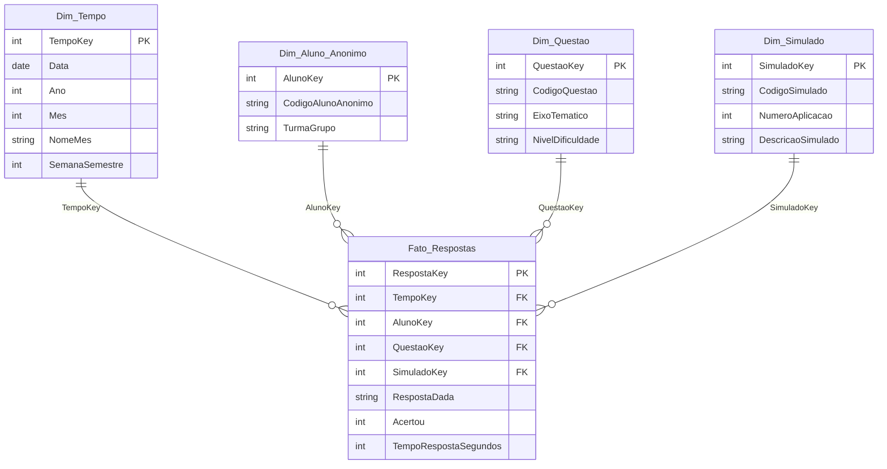

# BUSINESS INTELLIGENCE — PROJETO INTEGRADOR

## MODELAGEM DIMENSIONAL DO BANCO DE QUESTÕES/RESPOSTAS

### ENADE Analytics — Semana 5

Atividade do guia da Semana 5. As decisões abaixo são as do modelo já
materializado em [marco-2.md](./marco-2.md) e em `modelo-dimensional/`.

| **Entrega**            | Semana 5 — modelagem dimensional (base do Marco 2)                                                       |
| ---------------------- | -------------------------------------------------------------------------------------------------------- |
| **Equipe**             | RevelaDados                                                                                              |
| **Integrantes**        | • Alessandro Sondey Rodrigues Lima   • João Luiz Vicente Junior   • Leandro Zeni                   |
| **Base de referência** | [Marco 0](./marco-0.md) · [Marco 1](./marco-1.md) · Portaria Inep nº 171/2026 · ENADE em 29/11/2026      |
| **Data**               | 25/09/2026                                                                                               |

Edital: [Portaria Inep nº 171/2026](https://mecnormas.mec.gov.br/pesquisa/detalhar/11236).

---

## Decisões trazidas do Marco 1

O banco de questões cobre os **16 eixos** do componente específico (Portaria
Inep nº 171/2026, Art. 6º):

| **#** | **Eixo temático**                        |
| ----- | ---------------------------------------- |
| I     | Algoritmos                               |
| II    | Arquitetura de computadores              |
| III   | Sistemas operacionais                    |
| IV    | Banco de dados                           |
| V     | Engenharia de software                   |
| VI    | Gerência de projetos                     |
| VII   | Gestão de pessoas                        |
| VIII  | Gestão dos serviços de TI                |
| IX    | Tecnologias para inteligência de negócio |
| X     | Governança de tecnologia da informação   |
| XI    | Gestão estratégica organizacional        |
| XII   | Processos organizacionais                |
| XIII  | Redes de computadores                    |
| XIV   | Segurança da informação                  |
| XV    | Sistemas de informações gerenciais       |
| XVI   | Ética, tecnologia e sociedade            |

Níveis de dificuldade definidos pela equipe: **Fácil**, **Médio** e **Difícil**.
Eixo e dificuldade são atributos de `Dim_Questao`. Não há dimensão separada de
eixo.

---

## Quatro passos de Kimball

| **Passo**               | **Preenchimento para o projeto**                                                                                                                                         |
| ----------------------- | ------------------------------------------------------------------------------------------------------------------------------------------------------------------------ |
| 1. Processo de negócio  | Avaliação do desempenho dos concluintes nos simulados preparatórios para o ENADE 2026 (prova em 29/11/2026), por eixo temático, turma/grupo, simulado e período.       |
| 2. Granularidade (grão) | 1 resposta de 1 aluno anônimo a 1 questão em 1 tentativa/aplicação de simulado.                                                                                          |
| 3. Dimensões            | `Dim_Tempo`; `Dim_Aluno_Anonimo`; `Dim_Questao`; `Dim_Simulado`.                                                                                                         |
| 4. Fatos                | `Acertou` (contador aditivo 0 ou 1), `RespostaDada` e `TempoRespostaSegundos`. A taxa de acerto não é armazenada.                                                        |

O grão é o nível mais fino: permite desempenho por eixo, por turma e ao longo
do tempo sem remodelar o esquema depois.

`Acertou` vale 1 quando a resposta confere com o gabarito e 0 quando não
confere. A taxa de acerto por eixo, turma ou simulado é sempre calculada na
consulta: `SOMA(Acertou) / CONTAGEM(respostas)`.

---

## Esquema estrela

`Fato_Respostas` no centro. Cada dimensão se liga à fato pela chave substituta.
Cardinalidade **1:\***, filtro da dimensão para a fato.

| **Tabela**              | **Campos**                                                                                                             |
| ----------------------- | ---------------------------------------------------------------------------------------------------------------------- |
| Fato (`Fato_Respostas`) | `RespostaKey`; `TempoKey`; `AlunoKey`; `QuestaoKey`; `SimuladoKey`; `RespostaDada`; `Acertou`; `TempoRespostaSegundos` |
| Dim_Tempo               | `TempoKey`; `Data`; `Ano`; `Mes`; `NomeMes`; `SemanaSemestre`                                                          |
| Dim_Aluno_Anonimo       | `AlunoKey`; `CodigoAlunoAnonimo`; `TurmaGrupo`                                                                         |
| Dim_Questao             | `QuestaoKey`; `CodigoQuestao`; `EixoTematico`; `NivelDificuldade`                                                      |
| Dim_Simulado            | `SimuladoKey`; `CodigoSimulado`; `NumeroAplicacao`; `DescricaoSimulado`                                                |

Arquivos do modelo: [`esquema-estrela.sql`](./modelo-dimensional/esquema-estrela.sql),
[`esquema-estrela.dbml`](./modelo-dimensional/esquema-estrela.dbml) e CSVs em
`modelo-dimensional/powerbi/`.

---

## Checkpoint LGPD

- [x] Nenhuma dimensão contém nome, CPF, e-mail ou qualquer identificador direto
      do estudante.
- [x] Para distinguir alunos, o modelo usa código anônimo (`CodigoAlunoAnonimo`,
      ex.: `Aluno_014`), gerado antes da modelagem. O dado original não entra no
      DW.
- [ ] O termo de consentimento do Marco 1 ([termo-lgpd.md](./termo-lgpd.md))
      será aplicado a todos os participantes do simulado-piloto antes de
      qualquer coleta. O dataset atual em `modelo-dimensional/powerbi/` é seed
      sintético, não coleta real.
